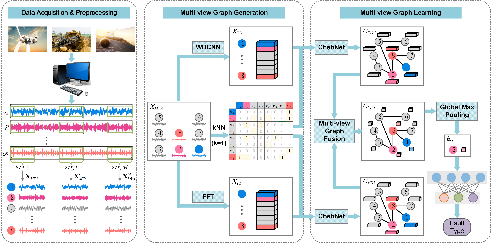

# Noise-Robust Multi-View Graph Neural Network (MvGNN)

> **Noise-robust multi-view graph neural network for fault diagnosis of rotating machinery**  
> Chenyang Li, Lingfei Mo, Chee Keong Kwoh, Xiaoli Li, Zhenghua Chen, Min Wu, and Ruqiang Yan  
> *Mechanical Systems and Signal Processing*, Volume 224, Article 112025, 2025

[](https://www.sciencedirect.com/science/article/pii/S0888327024009233)
[](https://doi.org/10.1016/j.ymssp.2024.112025)
[](LICENSE)

MvGNN models normalized multi-sensor signals as a multi-view graph with a shared topology and complementary time-domain (TD) and frequency-domain (FD) node features. Independent ChebNet branches aggregate information within the two views, and a node-level view-attention block learns their unified representation for graph-level fault classification.

## Overall Framework

<p align="center">
  
</p>

As described in the paper, the overall framework comprises four components:

1. **Multi-view graph generation.** Each sensor channel is represented as a node. For every normalized 1024-point window, Euclidean-distance kNN (`k = 1`) constructs a symmetric, undirected graph shared by both views. Within this component, `N` independently parameterized three-layer WDCNNs transform the signals into `N × 256` TD-view node features, while FFT removes the DC component and retains magnitude coefficients from bins 1 through 512 (including the Nyquist bin) to produce `N × 512` FD-view node features.
2. **Multi-view graph aggregation.** Two independent one-layer ChebNet branches (`K = 2`) aggregate multi-sensor information within the TD-view and FD-view graphs, respectively, mapping both views to `N × 64` node representations.
3. **Multi-view graph fusion.** The view-attention block applies intra-view and inter-view softmax operations to learn node-level attention coefficients and obtains a unified multi-view representation through the weighted sum of the TD and FD views.
4. **Graph classification.** Graph global max pooling converts the fused node representations into a graph-level representation, which is passed to a fully connected layer with softmax to infer the health state.

## Repository structure

```text
├── configs/                   # XJTU and SEU experiment configurations
├── data/README.md             # Data preparation and NPZ schema
├── mvgnn/
│   ├── data.py                # Normalization, FFT, and kNN graph construction
│   ├── model.py               # MvGNN architecture
│   ├── preprocessing.py       # HDF5 parsing, windowing, label mapping, and noise injection
│   └── utils.py               # Configuration and reproducibility utilities
├── scripts/
│   ├── prepare_xjtu.py        # XJTU HDF5-to-NPZ preparation
│   ├── prepare_seu.py         # SEU HDF5-to-NPZ preparation
├── train.py                   # Training, early stopping, and checkpointing
├── evaluate.py                # Checkpoint evaluation
├── overall_framework_new.png
└── requirements.txt
```

## Installation

Python 3.9 or later is recommended. Install PyTorch for the appropriate CUDA or CPU platform first, then run:

```bash
git clone https://github.com/XMAHA/Noise-robust-multi-view-graph-neural-network-for-fault-diagnosis-of-rotating-machinery.git
cd Noise-robust-multi-view-graph-neural-network-for-fault-diagnosis-of-rotating-machinery

python -m venv .venv
source .venv/bin/activate
pip install -r requirements.txt
```

`torch-cluster` must match the installed PyTorch/CUDA build. If pip cannot find a compatible wheel, install it from the [PyTorch Geometric wheel index](https://data.pyg.org/whl/) for your PyTorch version.

## XJTU quick start

Download the processed XJTU HDF5 file from [Google Drive](https://drive.google.com/file/d/1haWvkKF8jKgdtWrfrQ2njPeMvCBo9i84/view?usp=drive_link), or use:

```bash
curl -L --fail \
  'https://drive.usercontent.google.com/download?id=1haWvkKF8jKgdtWrfrQ2njPeMvCBo9i84&export=download&confirm=t' \
  -o data/XJ_Suprgear_15_20_multi_1024_TD_ordered.h5
```

Verify the download and convert it to the aligned NPZ consumed by the training code:

```bash
echo "3eabd5762fb73c25e3272074453d074e222801f0d0ba2d4afb70b5d37feede2a  data/XJ_Suprgear_15_20_multi_1024_TD_ordered.h5" | sha256sum --check -

python scripts/prepare_xjtu.py \
  --input data/XJ_Suprgear_15_20_multi_1024_TD_ordered.h5 \
  --output data/xjtu_snr100.npz \
  --snr 100
```

Then train and evaluate as described below. The downloaded HDF5 file is the processed version used by this release; it contains real XJTU measurements rather than synthetic demo signals.

## Datasets and preprocessing

The paper uses two public rotating-machinery datasets:

| Dataset | Sampling rate | Rotation speeds | Sensors / nodes | Classes | Samples per class and speed |
|---|---:|---|---:|---:|---:|
| XJTU Spurgear | 10 kHz | 900, 1200 r/min | 12 | 5 | 1000 |
| SEU mechanical | 5120 Hz | 1200, 1800, 2400, 3000 r/min | 8 | 9 | 1000 |

The XJTU task contains health and tooth-root cracks of 0.2, 0.6, 1.0, and 1.4 mm. The SEU task combines health, four bearing-fault states, and four gear-fault states. Signals from different speeds but the same health state share a label.

Following Section 4.1.3 of the paper, signals are divided into non-overlapping windows of 1024 samples and normalized per sensor window. `scripts/prepare_xjtu.py` and `scripts/prepare_seu.py` convert the original condition-keyed HDF5 files, reproduce the paper label merging, and optionally inject Gaussian noise at a specified SNR. At load time, `torch_cluster.knn_graph` constructs the paper-consistent `k = 1` undirected graph and FFT generates the 512-dimensional FD view. See [data/README.md](data/README.md) for commands, schema, and class mappings.

Prepare clean XJTU and SEU files (`--snr 100` follows the original code convention and disables added noise):

```bash
python scripts/prepare_xjtu.py \
  --input /path/to/XJTU_TD_ordered.h5 \
  --output data/xjtu_snr100.npz \
  --snr 100

python scripts/prepare_seu.py \
  --input /path/to/SEU_TD_ordered.h5 \
  --output data/seu_snr100.npz \
  --snr 100
```

For a noisy condition, change `--snr` to the desired dB value, for example `--snr -10`. Noise is added to each segmented TD sample before the loader performs per-window normalization. The preparation scripts keep TD windows, labels, source keys, and metadata in one aligned NPZ file; FD features and graph edges are generated at load time.

This project provides a processed version of the public XJTU dataset: non-overlapping 1024-point windows with condition labels, rather than the original continuous acquisition files. The SEU dataset is not redistributed and must be obtained from its official source. When using either dataset, comply with its terms and cite the associated publication: Li et al., *Mechanical Systems and Signal Processing* 168 (2022), [doi:10.1016/j.ymssp.2021.108653](https://doi.org/10.1016/j.ymssp.2021.108653), for XJTU; and Shao et al., *IEEE Transactions on Industrial Informatics* 15(4) (2019), [doi:10.1109/TII.2018.2864759](https://doi.org/10.1109/TII.2018.2864759), for SEU. Complete BibTeX entries and processing details are provided in [data/README.md](data/README.md#dataset-citations).

## Training and evaluation

Train on XJTU:

```bash
python train.py \
  --config configs/xj_paper.json \
  --data /path/to/xj.npz \
  --output checkpoints/xj_mvgnn.pt
```

Train on SEU:

```bash
python train.py \
  --config configs/seu_paper.json \
  --data /path/to/seu.npz \
  --output checkpoints/seu_mvgnn.pt
```

Evaluate a labeled file:

```bash
python evaluate.py \
  --checkpoint checkpoints/xj_mvgnn.pt \
  --data /path/to/xj_test.npz
```

The release selects a checkpoint using validation accuracy and evaluates the test split after selection. Checkpoints store the model `state_dict`, configuration, selected epoch, validation accuracy, and exact train/validation/test indices.

## Model configuration from the paper

The following values are reported in Table 3 and Section 4.2.1:

| Setting | XJTU | SEU |
|---|---:|---:|
| Input node dimension | 1024 | 1024 |
| Graph neighbors `k` | 1 | 1 |
| Sensors / nodes `N` | 12 | 8 |
| Classes | 5 | 9 |
| WDCNN layers | 3 | 3 |
| WDCNN wide kernel | 88 | 104 |
| TD-view dimension | 256 | 256 |
| FFT magnitude bins (DC removed) | 1–512 | 1–512 |
| ChebNet layers | 1 | 1 |
| Chebyshev order `K` | 2 | 2 |
| Graph hidden dimension | 64 | 64 |
| Attention intermediate dimension | `2N` | `2N` |

The JSON files also contain training defaults recovered from the accompanying experiment code: batch size 16, learning rate 0.005, at most 50 epochs, and early-stopping patience 5. These optimization values are implementation defaults and are not listed in the paper tables.

## Paper evaluation protocol and reported results

- Random split: 80% training, 10% validation, and 10% testing.
- Metrics: mean classification accuracy and standard deviation over ten trials.
- Robustness study: Gaussian noise at SNR levels from −10 dB to 10 dB in 2 dB steps.
- Hyperparameter studies use −8 dB for XJTU and −4 dB for SEU.
- Under strong noise, MvGNN achieves 93.39% on XJTU at −10 dB and 95.88% on SEU at −6 dB.
- The separability study reports multi-view accuracies of 97.78% on XJTU at −8 dB and 98.89% on SEU at −4 dB.

This training script performs one seeded trial per invocation. To reproduce the paper statistics, prepare each target SNR with the corresponding `--snr` option, run ten independent trials with distinct configuration seeds, and report their mean and standard deviation. Every checkpoint records the exact train/validation/test indices used by that run; the historical split indices used for the published experiments are not available in the original research code.

## Reproducibility safeguards

- Dataset loading validates the 1024-point window length, expected sensor count, class range, and optional adjacency dimensions against the selected configuration.
- TD windows, labels, source keys, and metadata are stored together to avoid misalignment between separate HDF5 files.
- Mini-batches support a smaller final batch instead of assuming a fixed batch size.
- Early stopping uses validation accuracy; the test split is evaluated only after model selection.
- Checkpoints use a portable model `state_dict` and retain the configuration and exact split indices.

## Citation

If this work is useful in your research, please cite:

```bibtex
@article{LI2025112025,
  title    = {Noise-robust multi-view graph neural network for fault diagnosis of rotating machinery},
  author   = {Chenyang Li and Lingfei Mo and Chee Keong Kwoh and Xiaoli Li and Zhenghua Chen and Min Wu and Ruqiang Yan},
  journal  = {Mechanical Systems and Signal Processing},
  volume   = {224},
  pages    = {112025},
  year     = {2025},
  issn     = {0888-3270},
  doi      = {10.1016/j.ymssp.2024.112025},
  url      = {https://www.sciencedirect.com/science/article/pii/S0888327024009233},
  keywords = {Multi-view graph, Graph neural network, Multi-sensor information fusion, Attention mechanism, Fault diagnosis}
}
```

## License

The source code is released under the [MIT License](LICENSE). The datasets and published article are governed by their own licenses and terms of use.
