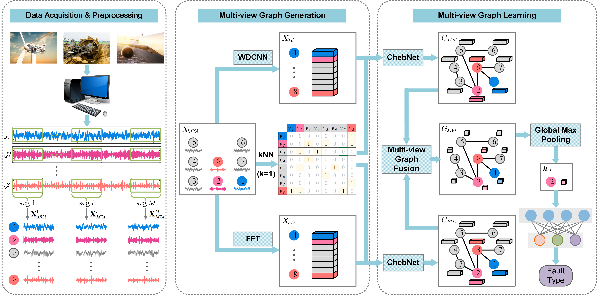

# Noise-Robust Multi-View Graph Neural Network (MvGNN)

> **Noise-robust multi-view graph neural network for fault diagnosis of rotating machinery**  
> Chenyang Li, Lingfei Mo, Chee Keong Kwoh, Xiaoli Li, Zhenghua Chen, Min Wu, and Ruqiang Yan  
> *Mechanical Systems and Signal Processing*, 224, 112025, 2025

[](https://www.sciencedirect.com/science/article/pii/S0888327024009233)
[](https://doi.org/10.1016/j.ymssp.2024.112025)
[](LICENSE)

MvGNN represents normalized multi-sensor signals as a multi-view graph with a shared topology and complementary time-domain (TD) and frequency-domain (FD) node features. Independent ChebNet branches aggregate the two views, and node-level view attention produces a unified representation for fault classification.

## Release scope

This repository releases the MvGNN architecture and an end-to-end **clean-signal** pipeline for the XJTU Spurgear and SEU mechanical datasets. It supports HDF5-to-NPZ preparation, integrity validation, training, validation-based checkpoint selection, and testing.

The released preparation scripts do not add synthetic noise. Consequently, this repository does not claim to reproduce the noisy-condition tables or robustness curves reported in the paper. Its reproduction scope is the model implementation and experiments using signals without additional synthetic noise.

## Overall framework

<p align="center">
  
</p>

The framework comprises four components:

1. **Multi-view graph generation.** Each sensor channel is a node. Euclidean-distance kNN (`k = 1`) constructs a symmetric graph from each normalized 1024-point window. `N` independently parameterized three-layer WDCNN encoders produce `N × 256` TD features. FFT removes the DC component and retains magnitude bins 1–512, including the Nyquist bin, as the FD features.
2. **Multi-view graph aggregation.** Independent one-layer ChebNet branches (`K = 2`) map both views to `N × 64` node representations.
3. **Multi-view graph fusion.** Intra-view and inter-view softmax operations learn node-level view weights, followed by a weighted sum of the TD and FD representations.
4. **Graph classification.** Global max pooling and a fully connected classifier infer the health state.

## Repository structure

```text
├── configs/                       # XJTU and SEU clean-data configurations
├── data/README.md                 # Data preparation, schema, and citations
├── mvgnn/
│   ├── data.py                    # Normalization, FFT, and kNN graphs
│   ├── model.py                   # MvGNN architecture
│   ├── preprocessing.py           # Clean HDF5 window selection and label mapping
│   └── utils.py                   # Configuration and random-seed utilities
├── scripts/
│   ├── prepare_xjtu.py            # Clean XJTU HDF5-to-NPZ conversion
│   ├── prepare_seu.py             # Clean SEU HDF5-to-NPZ conversion
│   ├── validate_prepared_data.py  # Shape, balance, and source-parity checks
│   └── run_trials.py              # Repeated trials and result summary
├── train.py
├── evaluate.py
├── REPRODUCIBILITY.md
└── requirements.txt
```

## Installation

Python 3.9 or later is recommended. Install the PyTorch build matching the local CUDA version, then install the remaining dependencies:

```bash
git clone https://github.com/XMAHA/Noise-robust-multi-view-graph-neural-network-for-fault-diagnosis-of-rotating-machinery.git
cd Noise-robust-multi-view-graph-neural-network-for-fault-diagnosis-of-rotating-machinery
python -m venv .venv
source .venv/bin/activate
python -m pip install --upgrade pip
pip install -r requirements.txt
```

`torch-cluster` must match the installed PyTorch/CUDA build. If necessary, install its wheel from the [PyTorch Geometric wheel index](https://data.pyg.org/whl/).

## Datasets

| Dataset | Sampling rate | Speeds (r/min) | Nodes | Classes | Selected windows per condition |
|---|---:|---|---:|---:|---:|
| XJTU Spurgear | 10 kHz | 900, 1200 | 12 | 5 | 1000 |
| SEU mechanical | 5120 Hz | 1200, 1800, 2400, 3000 | 8 | 9 | 1000 |

Signals from different speeds but the same health state share a class. Each NPZ stores clean 1024-point TD windows and labels. During loading, every sensor window is z-score normalized; the FD view is computed from that same normalized window; and `torch_cluster.knn_graph` constructs the sample-specific graph.

The processed XJTU HDF5 file is available from [Google Drive](https://drive.google.com/file/d/1haWvkKF8jKgdtWrfrQ2njPeMvCBo9i84/view?usp=drive_link). Its SHA-256 is `3eabd5762fb73c25e3272074453d074e222801f0d0ba2d4afb70b5d37feede2a`. SEU data must be obtained in accordance with the dataset's terms. See [data/README.md](data/README.md) for mappings, validation commands, and required citations.

## Prepare clean data

```bash
python scripts/prepare_xjtu.py \
  --input /path/to/XJ_Suprgear_15_20_multi_1024_TD_ordered.h5 \
  --output data/xjtu_clean.npz \
  --start-window 100 \
  --max-windows-per-condition 1000

python scripts/prepare_seu.py \
  --input /path/to/117_small_20-50_multi_1024_TD_ordered.h5 \
  --output data/seu_clean.npz \
  --start-window 0 \
  --max-windows-per-condition 1000
```

XJTU retains windows `100:1100` from each of ten conditions. SEU retains `0:1000` and excludes the four duplicate bearing-health conditions.

## Train and test

```bash
CUDA_VISIBLE_DEVICES=0 python train.py \
  --config configs/xj_paper.json \
  --data data/xjtu_clean.npz \
  --output checkpoints/xjtu_clean_seed0.pt \
  --device cuda --seed 0

CUDA_VISIBLE_DEVICES=0 python train.py \
  --config configs/seu_paper.json \
  --data data/seu_clean.npz \
  --output checkpoints/seu_clean_seed0.pt \
  --device cuda --seed 0

CUDA_VISIBLE_DEVICES=0 python evaluate.py \
  --checkpoint checkpoints/xjtu_clean_seed0.pt \
  --data data/xjtu_clean.npz --device cuda --split test

CUDA_VISIBLE_DEVICES=0 python evaluate.py \
  --checkpoint checkpoints/seu_clean_seed0.pt \
  --data data/seu_clean.npz --device cuda --split test
```

For source validation, GPU smoke tests, and ten-trial commands, see [REPRODUCIBILITY.md](REPRODUCIBILITY.md).

## Model configuration

| Setting | XJTU | SEU |
|---|---:|---:|
| Input length | 1024 | 1024 |
| Graph neighbors `k` | 1 | 1 |
| Sensors / nodes | 12 | 8 |
| Classes | 5 | 9 |
| WDCNN layers | 3 | 3 |
| First-layer kernel | 88 | 104 |
| TD-view dimension | 256 | 256 |
| FFT magnitude bins | 1–512 | 1–512 |
| ChebNet layers / order | 1 / 2 | 1 / 2 |
| Hidden dimension | 64 | 64 |
| Batch size | 16 | 16 |
| Learning rate | 0.005 | 0.005 |

The training pipeline uses an 80%/10%/10% stratified split. Early stopping uses validation accuracy. Checkpoints store the exact split indices, selected epoch, configuration, validation accuracy, and test accuracy.

## Reproducibility note

Seeds `0–9` are deterministic public reproduction runs; they do not reconstruct the unrecorded random splits of historical experiments. Compare distributions across repeated runs rather than expecting bitwise equality with a single historical run. Results from this release should be identified as clean-condition results.

## Citation

```bibtex
@article{LI2025112025,
  title   = {Noise-robust multi-view graph neural network for fault diagnosis of rotating machinery},
  author  = {Chenyang Li and Lingfei Mo and Chee Keong Kwoh and Xiaoli Li and Zhenghua Chen and Min Wu and Ruqiang Yan},
  journal = {Mechanical Systems and Signal Processing},
  volume  = {224},
  pages   = {112025},
  year    = {2025},
  doi     = {10.1016/j.ymssp.2024.112025},
  url     = {https://www.sciencedirect.com/science/article/pii/S0888327024009233}
}
```

## License

The source code is released under the [MIT License](LICENSE). Datasets and the published article remain subject to their own licenses and terms.
